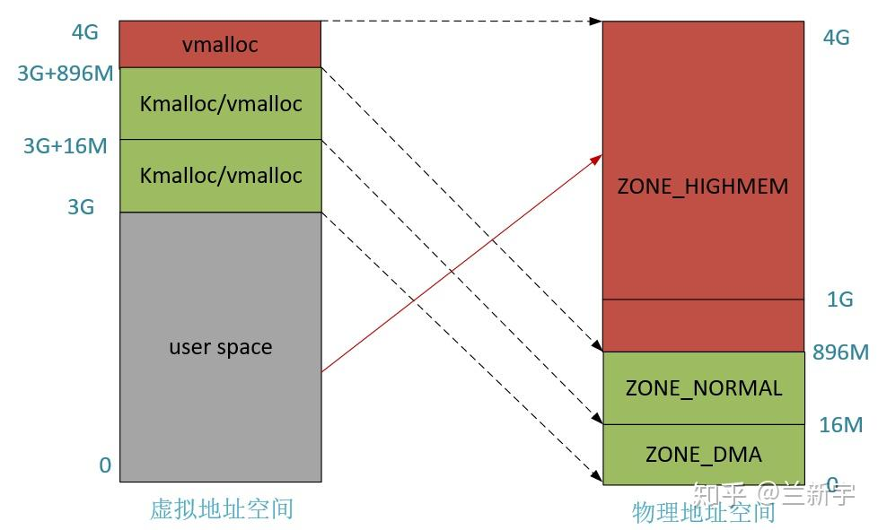
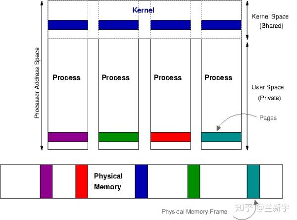
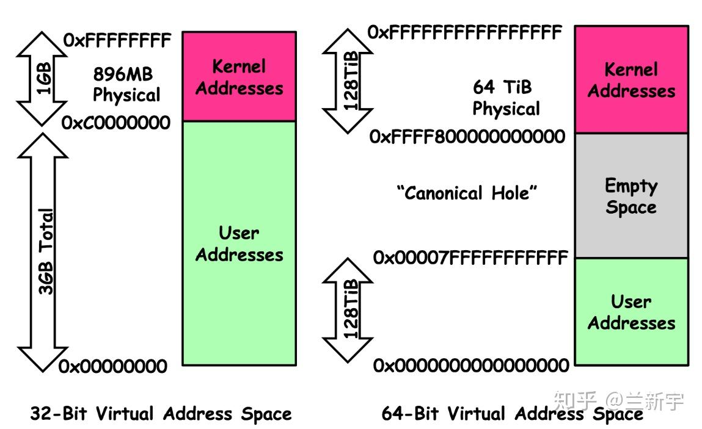
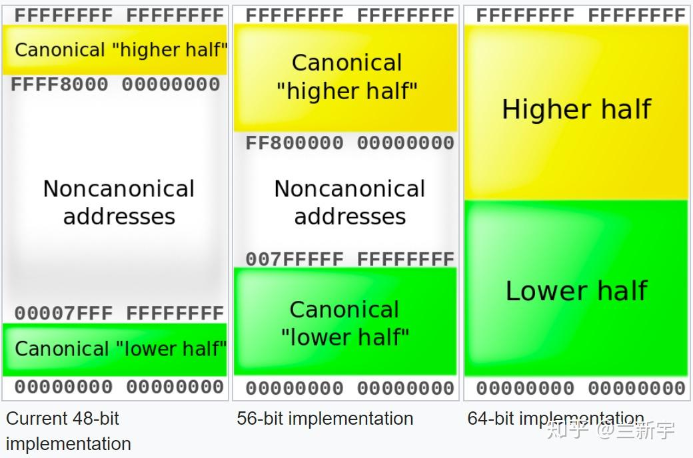
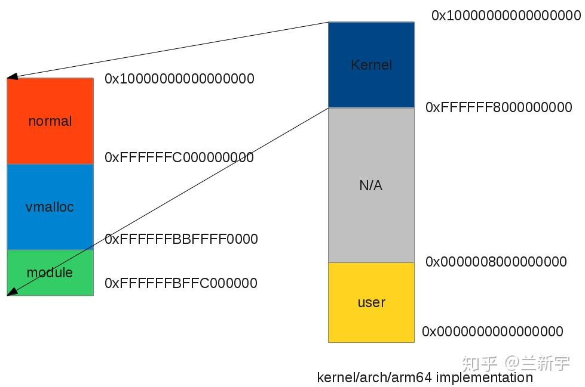
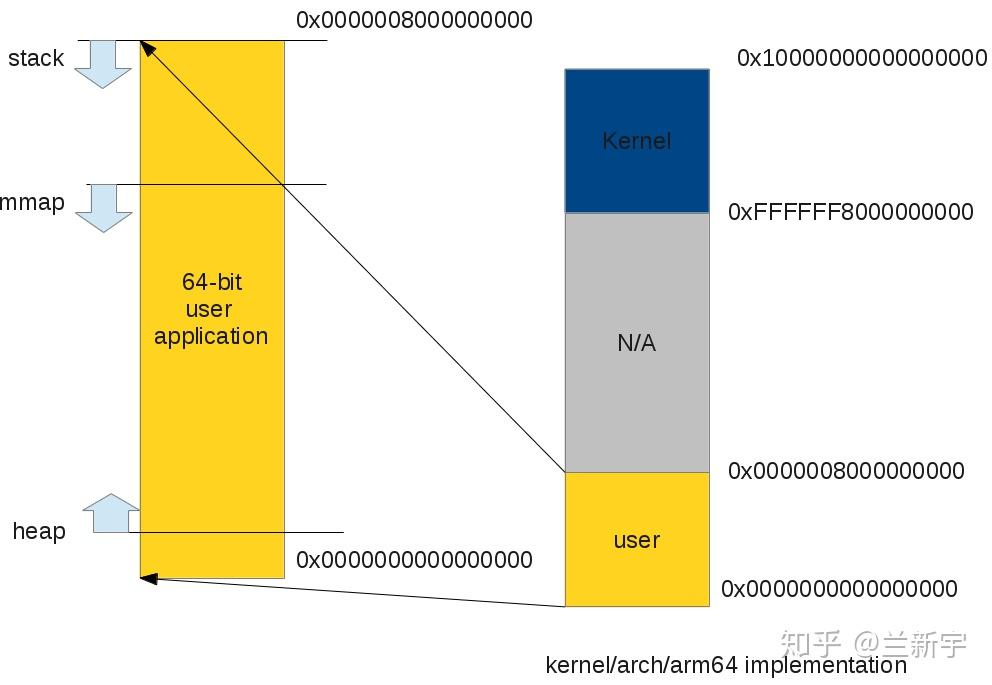
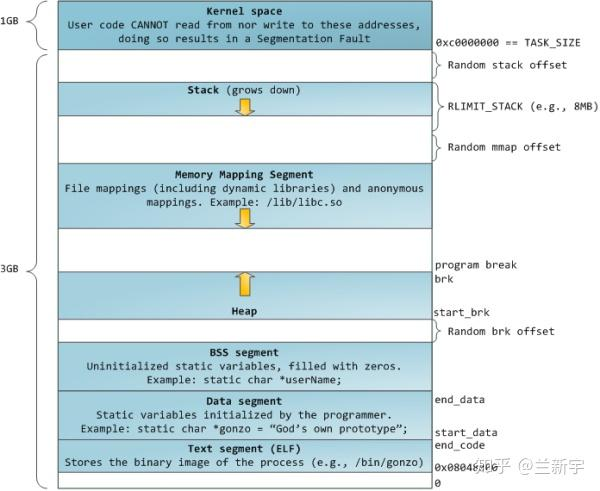

所谓进程地址空间（process address space），就是从进程的视角看到的地址空间，是进程运行时所用到的虚拟地址的集合。

32位系统的进程地址空间

以IA-32处理器为例，其虚拟地址为32位，因此其虚拟地址空间的范围为 
 ，Linux系统将地址空间按3:1比例划分，其中用户空间（user space）占3GB，内核空间（kernel space）占1GB。

假设物理内存也是4GB（事实上，虚拟地址空间的范围不一定需要和物理地址空间的大小相同），则虚拟地址空间和物理地址空间的转换如下图所示：

因为内核的虚拟地址空间只有1GB，但它需要访问整个4GB的物理空间，因此从物理地址0~896MB的部分（ZONE_DMA+ZONE_NORMAL），直接加上3GB的偏移（在Linux中用PAGE_OFFSET表示），就得到了对应的虚拟地址，这种映射方式被称为线性/直接映射（Direct Map）。

而896M~4GB的物理地址部分（ZONE_HIGHMEM）需要映射到(3G+896M)~4GB这128MB的虚拟地址空间，显然也按线性映射是不行的。

采用的是做法是，ZONE_HIGHMEM中的某段物理内存和这128M中的某段虚拟空间建立映射，完成所需操作后，需要断开与这部分虚拟空间的映射关系，以便ZONE_HIGHMEM中其他的物理内存可以继续往这个区域映射，即动态映射的方式。

用户空间的进程只能访问整个虚拟地址空间的0~3GB部分，不能直接访问3G~4GB的内核空间部分，但出于对性能方面的考虑，Linux中内核使用的地址也是映射到进程地址空间的（被所有进程共享），因此进程的虚拟地址空间可视为整个4GB（虽然实际只有3GB）。

64位系统的进程地址空间

在64位系统中，进程地址空间的大小就不固定了，以ARMv8-A为例，它的page大小可以是4KB, 16KB或者64KB（默认为4KB，选一种来用，不要混用），可采用3级页表或4级页表，因此可以有多种组合的形式。

以采用4KB的页，4级页表，虚拟地址为48位的系统为例（从ARMv8.2架构开始，支持虚拟地址和物理地址的大小最多为52位），其虚拟地址空间的范围为 
 ，按照1:1的比例划分，内核空间和用户空间各占128TB。

 

 256TB已经很大很大了，但是面对64位系统所具备的16EB的地址范围，根本就用不完。为了以后扩展的需要（比如虚拟地址扩大到56位），用户虚拟空间和内核虚拟空间不再是挨着的，但同32位系统一样，还是一个占据底部，一个占据顶部，所以这时user space和kernel space之间偌大的区域就空出来了。

但这段空闲区域也不是一点用都没有，它可以辅助进行地址有效性的检测。如果某个虚拟地址落在这段空闲区域，那就是既不在user space，也不在kernel space，肯定是非法访问了。使用48位虚拟地址，则kernel space的高16位都为1，如果一个试图访问kernel space的虚拟地址的高16位不全为1，则可以判断这个访问也是非法的。同理，user space的高16位都为0。这种高位空闲地址被称为canonical。

在64位系统中，内核空间的映射变的简单了，因为这时内核的虚拟地址空间已经足够大了，即便它要访问所有的物理内存，直接映射就是，不再需要ZONE_HIGHMEM那种动态映射机制了。

64位系统中用户空间的映射和32位系统没有太大的差别。

ARM公司宣称64位的ARMv8是兼容32位的ARM应用的，所有的32位应用都可以不经修改就在ARMv8上运行。那32位应用的虚拟地址在64位内核上是怎么分布的呢？事实上，64位内核上的所有进程都是一个64位进程。要运行32位的应用程序, Linux内核仍然从64位init进程创建一个进程, 但将用户地址空间限制为4GB。通过这种方式, 我们可以让64位Linux内核同时支持32位和64位应用程序。

要注意的是, 32位应用程序仍然对应128TB的内核虚拟地址空间, 并且不与内核共享自己的4GB虚拟地址空间, 此时用户应用程序具有完整的4GB虚拟地址。而32位内核上的32位应用程序只有3GB真正意义上的虚拟地址空间。

那进程地址空间到底是由哪些元素构成？

segments

一个进程通常由加载一个elf文件启动，而elf文件是由若干segments组成的，同样的，进程地址空间也由许多不同属性的segments组成，但这与硬件意义上的segmentation机制（参考这篇文章）不同，后者在某些体系结构（比如x86）中起重要作用，充当内存中物理地址连续的独立空间。Linux进程中的segment是虚拟地址空间中用于保存数据的区域，只在虚拟地址上连续。

text段包含了当前运行进程的二进制代码，其起始地址在IA32体系中中通常为0x08048000，在IA64体系中通常为0x0000000000400000（都是虚拟地址哈）。data段存储已初始化的全局变量，bss段存储未初始化的全局变量。从上图可以看出，这3个segments是紧挨者的，因为它们的大小是确定的，不会动态变化。

与之相对应的就是heap段和stack段。heap段存储动态分配的内存中的数据，stack段用于保存局部变量和实现函数/过程调用的上下文，它们的大小都是会在进程运行过程中发生变化的，因此中间留有空隙，heap向上增长，stack向下增长，因为不知道heap和stack哪个会用的多一些，这样设置可以最大限度的利用中间的空隙空间。

还有一个段比较特殊，是mmap()系统调用映射出来的。mmap映射的大小也是不确定的。3GB的虚拟地址空间已经很大了，但heap段, stack段，mmap段在动态增长的过程还是有重叠（碰撞）的可能（关于如何避免重叠，请参考文末 @叶碧的评论）。如果是64位系统，则虚拟地址空间更加巨大，几乎不可能发生重叠。

如果stack段和mmap段都采用固定的起始地址，这样实现起来简单，而且所有Linux系统都能保持统一，但是真实的世界不是那么简单纯洁的，正邪双方的较量一直存在。对于攻击者来说，如果他知道你的这些segments的起始地址，那么他构建恶意代码（比如通过缓冲区溢出获得栈内存区域的访问权，进而恶意操纵栈的内容）就变得容易了。

一个可以采用的反制措施就是不为这些segments的起点选择固定位置，而是在每次新进程启动时（通过设置PF_RANDOMIZE标志）随机改变这些值的设置。

那这些segments的加载顺序是怎样的呢？以下图为例，首先通过execve()执行elf，则该可执行文件的text段，data段，stack段就建立了，在进程运行过程中，可能需要借助ld.so加载动态链接库，比如最常用的libc，则libc.so的text段，data段也建立了，而后可能通过mmap()的匿名映射来实现与其他进程的共享内存，还有可能通过brk()来扩大heap段的大小。

vm_area_struct

在Linux中，每个segment用一个vm_area_struct（以下简称vma）结构体表示。vma是通过一个双向链表（早期的内核实现是单向链表）串起来的，现存的vma按起始地址以递增次序被归入链表中，每个vma是这个链表里的一个节点。

在用户空间可通过"/proc/PID/maps"接口来查看一个进程的所有vma在虚拟地址空间的分布情况，其内部实现靠的就是对这个链表的遍历。

同时，vma又通过红黑树（red black tree）组织起来，每个vma又是这个红黑树里的一个节点。为什么要同时使用两种数据结构呢？使用链表管理固然简单方便，但是通过查找链表找到与特定地址关联的vma，其时间复杂度是O(N)，而现实应用中，在进程地址空间中查找vma又是非常频繁的操作（比如发生page fault的时候）。

使用红黑树的话时间复杂度是O( 
 )，尤其在vma数量很多的时候，可以显著减少查找所需的时间（数量翻倍，查找次数也仅多一次）。同时，红黑树是一种非平衡二叉树，可以简化重新平衡树的过程。

现在我们来看一下vm_area_struct结构体在Linux中是如何定义的（这里为了讲解的需要对结构体内元素的分布有所调整，事实上，结构体元素的分布是有讲究的，将相关的元素相邻放置并按cache line对齐，有利于它们在cache中处于同一条cache line上，提高效率）：

struct vm_area_struct 
{ 
	unsigned long vm_start; 
	unsigned long vm_end;  
	struct vm_area_struct *vm_next, *vm_prev; 
	rb_node_t vm_rb; 
        unsigned long vm_flags;
        struct file * vm_file;
        unsigned long vm_pgoff;
	struct mm_struct * vm_mm; 
	...
}
其中，vm_start和vm_end分别是这个vma所指向区域的起始地址和结束地址，虽然vma是虚拟地址空间，但最终毕竟是要映射到物理内存上去的，所以也要求是4KB对齐的。

vm_next是指向链表的下一个vma，vm_rb是作为红黑树的一个节点。

vm_flags描述的是vma的属性，flag可以是VM_READ、VM_WRITE、VM_EXEC、VM_SHARED，分别指定vma的内容是否可以读、写、执行，或者由几个进程共享。前面介绍的页表PTE中也有类似的Read/Write权限限制位，那它和vma中的这些标志位是什么关系呢？

vma由许多的虚拟pages组成，每个虚拟page需要经过page table的转换才能找到对应的物理页面。PTE中的Read/Write位是由软件设置的，设置依据就是这个page所属的vma，因此一个vma设置的VM_READ/VM_WRITE属性会复制到这个vma所含pages的PTE中。

之后，硬件MMU就可以在地址翻译的过程中根据PTE的标志位来检测访问是否合法，这也是为什么PTE是一个软件实现的东西，但又必须按照处理器定义的格式去填充，这可以理解为软硬件之间的一种约定。那可以用软件去检测PTE么？当然可以，但肯定没有用专门的硬件单元来处理更快嘛。

可执行文件和动态链接库的text段和data段是基于elf文件的，mmap对文件的映射也是对应外部存储介质中这个被映射的文件的，这两种情况下，vm_file指向这个被映射的文件，进而可获得该文件的inode信息，而"vm_pgoff"是这个段在该文件内的偏移。

对于text段，一般偏移就是0。对于heap段，stack段以及mmap的匿名映射，没有与之相对应的文件实体，此时"vm_file"就为NULL，"vm_pgoff"的值没有意义。

那一个进程是怎么找到它的这些vma呢？

mm_struct

上文vm_area_struct中还有一个vm_mm没讲到，而这个vm_mm，则是联系vm_area_struct和它所属进程的关键纽带。它指向的是负责管理内存的mm_struct结构体，而这个mm_struct又可以从task_struct这个几乎记录了一个进程所有信息的结构体中获取。

来看下struct mm_struct中与vma相关的元素有哪些：

struct mm_struct
{          
    struct vm_area_struct * mmap;                 
    struct rb_root mm_rb;    
    int map_count;   
    unsigned long total_vm;    
    struct vm_area_struct * mmap_cache;   
    unsigned long (*)()get_unmapped_area; 
    ...  
} 
其中mmap指向vma链表的头节点，mm_rb指向vma红黑树的根节点。map_count是vma的总个数，total_vm是进程地址空间的总大小（以page为单位）。

mmap_cache保存了上一次找到的vma，根据局部性原理，下一次要用到的vma正好是上次使用的vma的可能性是比较大的，因此使用find_vma()函数查找vma时，会首先从mmap_cache中找，找到了就直接返回。

vma = mm->mmap_cache;    
if (vma && vma->vm_end > addr && vma->vm_start <= addr)
    return vma;
没找到再去红黑树里面找：

rb_node = mm->mm_rb.rb_node;    
vma = NULL;
while (rb_node) {        
    vma_tmp = rb_entry(rb_node, struct vm_area_struct, vm_rb);        
    if (vma_tmp->vm_end > addr) {            
        vma = vma_tmp;            
        if (vma_tmp->vm_start <= addr)                
            break;            
        rb_node = rb_node->rb_left;        
    } else            
        rb_node = rb_node->rb_right;    
}
if (vma)        
        mm->mmap_cache = vma;    
return vma;
这种mmap_cache的命中率通常只有35%-50%，之后内核开发者又在此基础上，设计了新的VMA cache方案。

对vma的操作除了查找，还有增加和删除。加载一个动态链接库或者通过mmap创建映射时，都需要在进程地址空间中增加一个vma。

具体过程是首先通过get_unmapped_area()找到虚拟地址空间中一块空闲且大小满足要求的区域（根据你上报的你家的人数，给你街道中一个住的下你家所有人的空房子），分配给新vma并设置其flag属性（限制你家对这个房子的使用，比如只能住，不能私自改建），返回该vma起始处的虚拟地址（告诉你这个房子的门牌号）。

当然，你出于某种目的，也可以指定就街道上的某间房子（调用mmap()时指定参数addr），如果这间房子正好是空的，就可以分配给你。

if (addr) {
    addr = PAGE_ALIGN(addr);                 
    vma = find_vma(mm, addr);                  
    if (TASK_SIZE -len >= addr &&                      
        (!vma || addr + len <= vma->vm_start))                         
            return addr;              
}
这里的房子有点特殊，街道上房间的总数是固定的，每个房间的大小是4平方米（页面大小4KB），只要是相邻的空房间，就可以组成一个空房子。房间总数也是有限的（3GB内存的话差不多是75万个房间），你来晚了，或者你狮子大开口，要一个50万房间的空房子（比如通过malloc(2G)），那就有可能出现分配不到的情况（可用虚拟地址空间不足）。

如果新建的vma和它地址上紧挨着的vma有相同的属性，且基于相同的映射对象（比如是同一个文件），则还会产生vma的合并（上下两层楼打通，做成一个跃层）。减少vma的数量有利于减轻内核的管理工作量，降低系统开销。如果没有发生合并，则需要调用insert_vm_struct( )在vma链表和vma红黑树中分别插入代表新vma的节点（给你家的房子被街道办事处登记，方便日后管理）。

要注意的是，房子的分配是按照你上报的人数，但具体给你几个房间的钥匙（分配几个物理页面），取决于你家实际住进来的人数，比如你申请的是10个房间，但只住进来3个人，就只有3个房间的钥匙，剩下的钥匙等真正有人搬进来再给，房间资源有限，占着不住不是浪费么。分配的vma只是这段虚拟地址的使用权，而不是物理地址的使用权。

那是不是我申请成功10个房间，就可以保证10个人都能住进来呢？这个嘛，街道（进程）最开始也是这样以为的，后来出现了房间申请成功，结果拿钥匙开不了门的情况，街道就向上级管理者（内核）反映啊，这才被告知了一个残酷的现实：除了本条街道，还有很多条其他街道，大家处在一个平行空间中（虚拟地址空间都是0~3GB），这70多万个房间，其实是被所有街道共享的，谁先拿到一个房间的钥匙（使用物理页面），谁才真正拥有这个房间。

一切都是假象……然后街道问上级：那你为啥一直允许我们街道上的人一口气申请那么多房间呢？上级若有所思的说：我当时设计这个制度啊，主要是考虑到很多人可能申请的多，但实际用不了那么多（比如malloc(2G)，但实际只用了1M）,我也不知道实际谁会用的多一点，为了让资源（这些房间）得到最充分的利用，我只能先允许他们申请着。以后这种事情多了，大家也渐渐明白，别一下申请那么多，不合理的需求，到了上级那里是通不过的，这种申请超过实际可用物理内存的现象，被称为memory overcommit。

通过munmap()解除映射时，则需要在进程地址空间中删除对应的vma，并释放该vma占有的虚拟地址资源。
